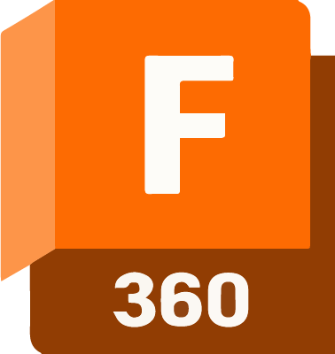
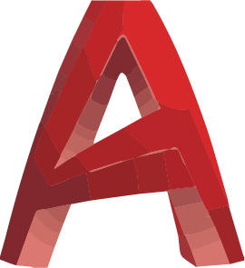
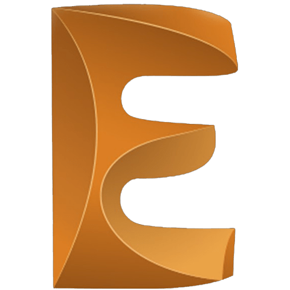
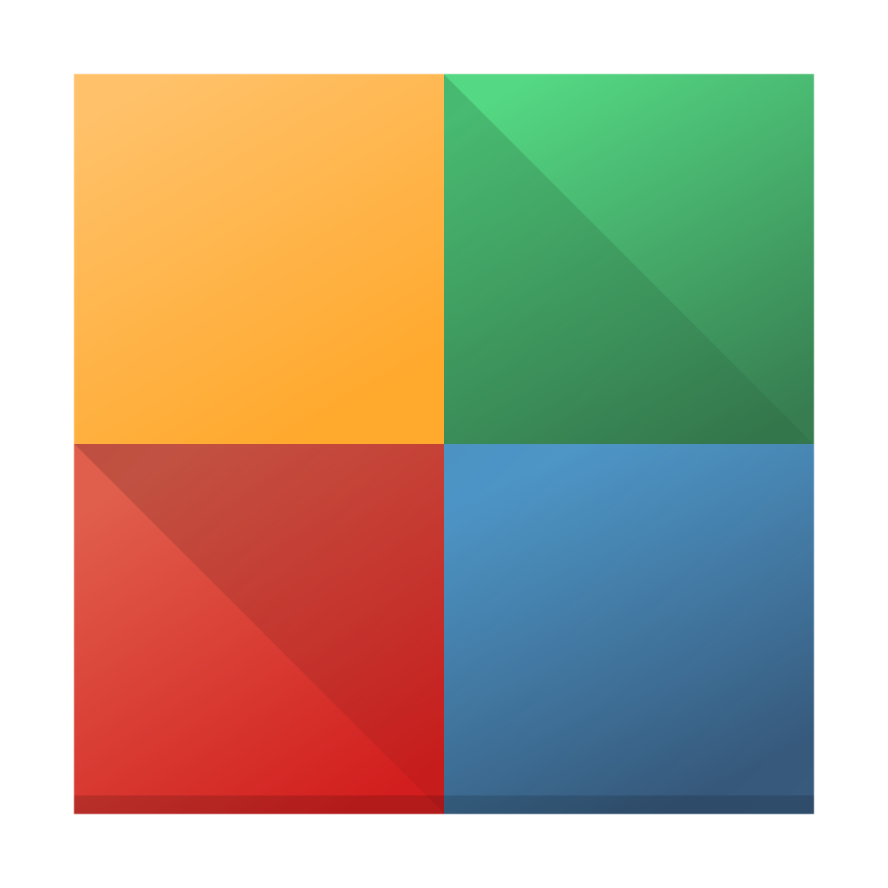

<pre align="center">
  _____               _                _    _                         _ 
 |_   _|_ _ _ __ ___ (_)_ __ ___      / \  | |__  _ __ ___   __ _  __| |
   | |/ _` | '_ ` _ \| | '_ ` _ \    / _ \ | '_ \| '_ ` _ \ / _` |/ _` |
   | | (_| | | | | | | | | | | | |  / ___ \| | | | | | | | | (_| | (_| |
   |_|\__,_|_| |_| |_|_|_| |_| |_| /_/   \_\_| |_|_| |_| |_|\__,_|\__,_|
 

 
</pre>

<h2 align="center">10+ Experience | Programmer | Electrical Engineer</h2>

 

##### About me :sunglasses:

---

> Hello, this is **Tamim Ahmad**. A self-motivated and enthusiastic designer and developer from Bangladesh. I am deeply interested in IoT. I am currently working in Arduino Electronics.
 

##### Achievements :dart:

---

`Capable to Electrical & Electronics troubleshooting.`  `Capable to Computer Hardware troubleshooting.`  `Capable to troubleshoot Networking issues.`  `Good analytical and problem solving skills.`  `Strong communication and social skills.`  `Sustainable leadership skills.`  `Dedicated and passionate Electrical schematic development with high progressive experience.`
 

 

##### Where to find me :speech_balloon:

---

          

 

##### Softwares / Tools :wrench:

---

&nbsp;&nbsp;&nbsp;&nbsp;&nbsp;&nbsp;&nbsp;&nbsp;&nbsp;&nbsp;&nbsp;&nbsp;&nbsp;&nbsp;&nbsp;&nbsp;&nbsp;&nbsp;&nbsp;&nbsp;&nbsp;&nbsp;&nbsp;&nbsp;&nbsp;&nbsp;&nbsp;&nbsp;&nbsp;&nbsp;
   

---

